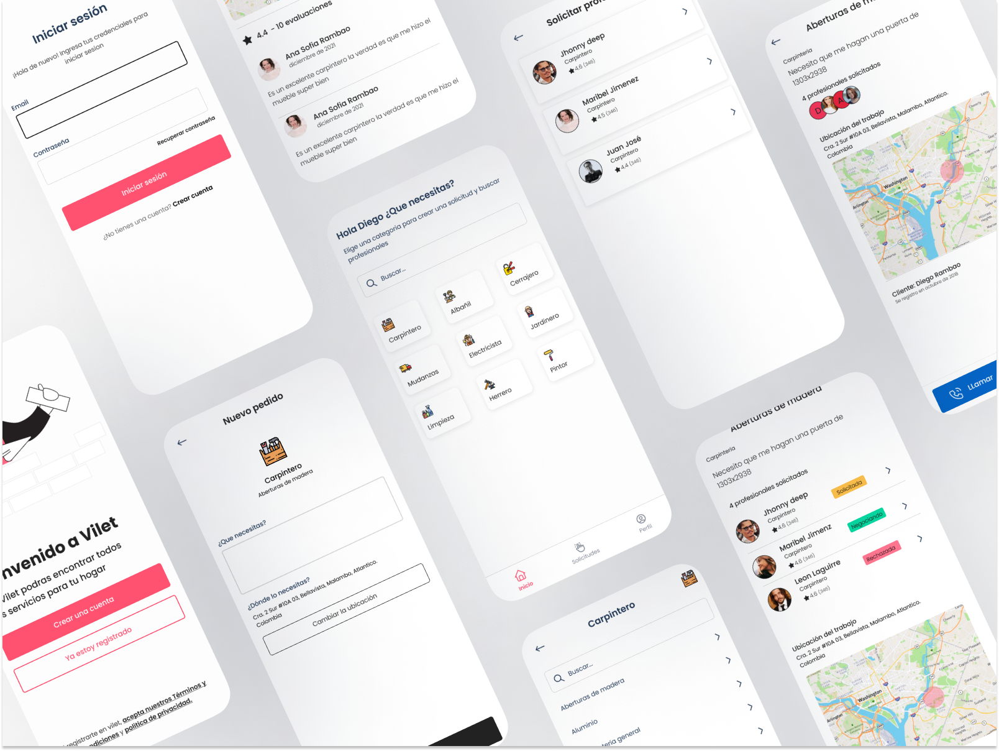

<!-- Improved compatibility of back to top link: See: https://github.com/othneildrew/Best-README-Template/pull/73 -->

<a name="readme-top"></a>

<!--
*** Thanks for checking out the Best-README-Template. If you have a suggestion
*** that would make this better, please fork the repo and create a pull request
*** or simply open an issue with the tag "enhancement".
*** Don't forget to give the project a star!
*** Thanks again! Now go create something AMAZING! :D
-->

<!-- PROJECT SHIELDS -->
<!--
*** I'm using markdown "reference style" links for readability.
*** Reference links are enclosed in brackets [ ] instead of parentheses ( ).
*** See the bottom of this document for the declaration of the reference variables
*** for contributors-url, forks-url, etc. This is an optional, concise syntax you may use.
*** https://www.markdownguide.org/basic-syntax/#reference-style-links
-->

[![Contributors][contributors-shield]][contributors-url]
[![Forks][forks-shield]][forks-url]
[![Stargazers][stars-shield]][stars-url]
[![Issues][issues-shield]][issues-url]
[![MIT License][license-shield]][license-url]
[![LinkedIn][linkedin-shield]][linkedin-url]

<!-- PROJECT LOGO -->
<br />
<div align="center">

<h1 align="center">Frontend Ionic Vilet</h3>

  <p align="center">
    frontend for vilet app
    <br />
    <a href="https://github.com/diegorambao/vilet-frontend"><strong>Explore the docs »</strong></a>
    <br />
    <br />
    <a href="https://github.com/diegorambao/vilet-frontend">Demo</a>
    ·
    <a href="https://github.com/diegorambao/vilet-frontend/issues">Report Bug</a>
    ·
    <a href="https://github.com/diegorambao/vilet-frontend/issues">Request Feature</a>
  </p>
</div>



<!-- TABLE OF CONTENTS -->
<details>
  <summary>Table of Contents</summary>
  <ol>
    <li>
      <a href="#about-the-project">About The Project</a>
      <ul>
        <li><a href="#built-with">Built With</a></li>
      </ul>
    </li>
    <li>
      <a href="#getting-started">Getting Started</a>
      <ul>
        <li><a href="#prerequisites">Prerequisites</a></li>
        <li><a href="#installation">Installation</a></li>
      </ul>
    </li>
    <li><a href="#usage">Usage</a></li>
    <li><a href="#roadmap">Roadmap</a></li>
    <li><a href="#contributing">Contributing</a></li>
    <li><a href="#license">License</a></li>
    <li><a href="#contact">Contact</a></li>
    <li><a href="#acknowledgments">Acknowledgments</a></li>
  </ol>
</details>

<!-- ABOUT THE PROJECT -->

## About The Project

The project is a mobile frontend that manages all user interaction, it is developed with `Ionic`

<p align="right">(<a href="#readme-top">back to top</a>)</p>

### Built With

- [![Node][node]][node-url]
- [![TypeScript][typescript]][typescript-url]
- [![Angular][angular.js]][angular-url]
- [![Ionic][ionic]][ionic-url]
- [![Capacitor][capacitor]][capacitor-url]

<p align="right">(<a href="#readme-top">back to top</a>)</p>

### Project tree

For the structure of the project, a clean architecture was implemented

```
|-- src /
  |-- base /
  |    |-- utils /
  |    |    |-- mapper.ts
  |    |    |-- use-case.ts
  |-- features /
  |    |-- your-feature /
  |    |    |-- domain /
  |    |    |    |-- models /
  |    |    |    |    |-- user.model.ts
  |    |    |    |-- repositories /
  |    |    |    |    |-- user.repository.ts
  |    |    |    |-- usecases /
  |    |    |    |    |-- user-login.usecase.ts
  |    |    |    |    |-- user-register.usecase.ts
  |    |    |    |    |-- get-user.usecase.ts
  |    |    |-- data /
  |    |    |    |-- entities /
  |    |    |    |    |-- user-entity.ts
  |    |    |    |-- mappers /
  |    |    |    |    |-- user-repository.mapper.ts
  |    |    |    |--user-implementation.repository.ts
  |    |    |-- presentation /
  |    |    |    |-- components /
  |    |    |    |-- pages /
  |    |    |    |-- directives /
  |    |    |
  |-- shared /


```

<!-- GETTING STARTED -->

## Getting Started

To start you must have `npm` installed.

### Prerequisites

To start it is recommended to have the ionic CLI installed

- npm
  ```sh
  npm i -g @ionic/cli
  ```

### Installation

1. Clone the repo
   ```sh
   git clone https://github.com/diegorambao/vilet-frontend.git
   ```
2. Install NPM packages

   ```sh
   npm install
   ```

3. to start a development server

```sh
 npm start
```

4. to run the tests

```sh
 npm test
```

<!-- <p align="right">(<a href="#readme-top">back to top</a>)</p> -->

<!-- USAGE EXAMPLES -->

<!-- ROADMAP -->

<!-- ## Roadmap

- [ ] Feature 1
- [ ] Feature 2
- [ ] Feature 3
  - [ ] Nested Feature

See the [open issues](https://github.com/diegorambao/vilet-frontend/issues) for a full list of proposed features (and known issues). -->

<p align="right">(<a href="#readme-top">back to top</a>)</p>

<!-- CONTRIBUTING -->

## Contributing

If you have a suggestion that would make this better, please fork the repo and create a pull request. You can also simply open an issue with the tag "enhancement".
Don't forget to give the project a star! Thanks again!

1. Fork the Project
2. Create your Feature Branch (`git checkout -b feature/AmazingFeature`)
3. Commit your Changes (`git commit -m 'Add some AmazingFeature'`)
4. Push to the Branch (`git push origin feature/AmazingFeature`)
5. Open a Pull Request

<p align="right">(<a href="#readme-top">back to top</a>)</p>

<!-- LICENSE -->

## License

Distributed under the MIT License. See `LICENSE.txt` for more information.

<p align="right">(<a href="#readme-top">back to top</a>)</p>

<!-- CONTACT -->

## Contact

diegorambao - [@twitter_handle](https://twitter.com/diegorambao)

Project Link: [https://github.com/diegorambao/vilet-frontend](https://github.com/diegorambao/vilet-frontend)

<p align="right">(<a href="#readme-top">back to top</a>)</p>

<!-- ACKNOWLEDGMENTS -->

<!-- ## Acknowledgments

- []()
- []()
- []()

<p align="right">(<a href="#readme-top">back to top</a>)</p> -->

<!-- MARKDOWN LINKS & IMAGES -->
<!-- https://www.markdownguide.org/basic-syntax/#reference-style-links -->

[contributors-shield]: https://img.shields.io/github/contributors/diegorambao/vilet-frontend.svg?style=for-the-badge
[contributors-url]: https://github.com/diegorambao/vilet-frontend/graphs/contributors
[forks-shield]: https://img.shields.io/github/forks/diegorambao/vilet-frontend.svg?style=for-the-badge
[forks-url]: https://github.com/diegorambao/vilet-frontend/network/members
[stars-shield]: https://img.shields.io/github/stars/diegorambao/vilet-frontend.svg?style=for-the-badge
[stars-url]: https://github.com/diegorambao/vilet-frontend/stargazers
[issues-shield]: https://img.shields.io/github/issues/diegorambao/vilet-frontend.svg?style=for-the-badge
[issues-url]: https://github.com/diegorambao/vilet-frontend/issues
[license-shield]: https://img.shields.io/github/license/diegorambao/vilet-frontend.svg?style=for-the-badge
[license-url]: https://github.com/diegorambao/vilet-frontend/blob/master/LICENSE.txt
[linkedin-shield]: https://img.shields.io/badge/-LinkedIn-black.svg?style=for-the-badge&logo=linkedin&colorB=555
[linkedin-url]: https://linkedin.com/in/linkedin_username
[node]: https://img.shields.io/badge/Nodejs-green?style=for-the-badge&logo=nodedotjs&logoColor=white
[node-url]: https://nestjs.com/
[angular.js]: https://img.shields.io/badge/angular.js-red?style=for-the-badge&logo=angular&logoColor=white
[angular-url]: https://angularjs.com/
[ionic]: https://img.shields.io/badge/ionic-blue?style=for-the-badge&logo=ionic&logoColor=white
[ionic-url]: https://www.ionic.com/
[typescript]: https://img.shields.io/badge/TypeScript-blue?style=for-the-badge&logo=typescript&logoColor=white
[typescript-url]: https://www.typescriptlang.org/
[capacitor]: https://img.shields.io/badge/capacitor-blue?style=for-the-badge&logo=capacitor&logoColor=white
[capacitor-url]: https://www.capacitorlang.org/

```

```
